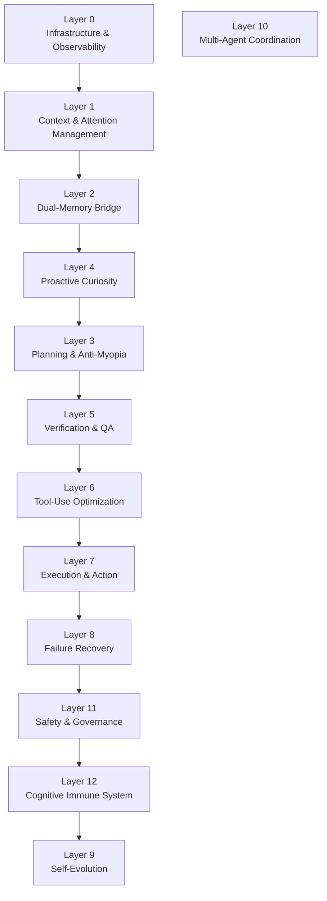

# 13-Layer Architecture

The AIO Framework organises agent cognition into 13 hierarchical layers. Each layer is implemented as a set of LangGraph nodes and conditional routing edges.

## Layer Overview

## Layer Descriptions

### Layer 0 — Infrastructure & Observability
- **Purpose:** OpenTelemetry tracing, Prometheus metrics, structured logging, optional LangSmith integration.
- **Key Class:** `ObservabilityLayer`
- **Priority:** 1

### Layer 1 — Context & Attention Management
- **Purpose:** Token-aware context window sculpting, BAPO attention routing, intent classification.
- **Key Class:** `ContextManager`
- **Priority:** 1

### Layer 2 — Dual-Memory Bridge
- **Purpose:** Episodic + long-term memory with encode-verify-store-consolidate-retrieve-forget lifecycle and hybrid search.
- **Key Class:** `MemoryBridge`
- **Priority:** 1

### Layer 3 — Planning & Anti-Myopia
- **Purpose:** Hierarchical planning (HiPlan), lookahead (FLARE), pitfall avoidance (PPA), symbolic MCTS (SPIRAL), DAG decomposition (VMAO).
- **Key Class:** `PlanningLayer`
- **Priority:** 2

### Layer 4 — Proactive Curiosity
- **Purpose:** Novelty detection, information gap identification, intrinsic reward scoring, counterfactual exploration, umwelt constraints.
- **Key Class:** `CuriosityEngine`
- **Priority:** 2

### Layer 5 — Verification & QA
- **Purpose:** Multi-modal verification ensemble (LLM critique + formal rules + competence scoring + debug hypotheses).
- **Key Class:** `Verifier`
- **Priority:** 1

### Layer 6 — Tool-Use Optimization
- **Purpose:** Tool necessity scoring (G-STEP), policy optimization (HDPO), prompt optimization (JTPRO), auto-deprecation.
- **Key Class:** `ToolOptimizer`
- **Priority:** 2

### Layer 7 — Execution & Action
- **Purpose:** HermesAgent routing, Docker sandbox execution, capability registry, MCP client integration.
- **Key Class:** `ToolGate`
- **Priority:** 1

### Layer 8 — Failure Recovery
- **Purpose:** ReCiSt state machine, NeuroShield boundaries, retry with exponential backoff, anti-fragility learning.
- **Key Class:** `FailureRecovery`
- **Priority:** 1

### Layer 9 — Self-Evolution
- **Purpose:** Performance analysis, trend reporting, safe config suggestions, bounded auto-apply.
- **Key Class:** `SelfEvolutionLayer`
- **Priority:** 3 (controlled by `ENABLE_PRIORITY_3`)

### Layer 10 — Multi-Agent Coordination
- **Purpose:** Task decomposition, simulated dispatch/aggregate/synthesize with consensus scoring.
- **Key Class:** `MultiAgentCoordinator`
- **Priority:** 3

### Layer 11 — Safety & Governance
- **Purpose:** Per-turn audit trail, constitutional compliance checks, governance voting, decision recording.
- **Key Class:** `SafetyGovernance`
- **Priority:** 3

### Layer 12 — Cognitive Immune System
- **Purpose:** Anomaly scanning, threat detection, quarantine, auto-heal, immunity status.
- **Key Class:** `CognitiveImmuneSystem`
- **Priority:** 3
