# Graph Routing

The compiled LangGraph defines nodes for every layer and conditional edges that decide which node runs next based on the current `AIOState`.

## High-Level Flow

```mermaid
flowchart LR
    ENTRY["context_ingest"] --> SCULPT["context_sculpt"]
    SCULPT --> SHIELD["neuroshield"]
    SHIELD -->|allowed| RETRIEVE["memory_retrieve"]
    SHIELD -->|blocked| ESCALATE["escalate"]
    RETRIEVE -->|low confidence| ENCODE["memory_encode"]
    RETRIEVE -->|high confidence| CURIOSITY["curiosity_intrinsic"]
    ENCODE --> VERIFY["memory_verify"] --> STORE["memory_store"] --> CONSOLIDATE["memory_consolidate"] --> CURIOSITY
    CURIOSITY --> SEEK["curiosity_seek"] --> SERENDIPITY["curiosity_serendipity"] --> COUNTER["curiosity_counterfactual"] --> UMWELT["curiosity_umwelt"]
    UMWELT --> PLAN["plan_generate"]
    PLAN --> MACI["maci_select"]
    MACI -->|multi-agent| DECOMPOSE["multi_agent_decompose"] --> DISPATCH["multi_agent_dispatch"] --> AGGREGATE["multi_agent_aggregate"] --> SYNTHESIZE["multi_agent_synthesize"] --> FLARE["flare"]
    MACI -->|single| HIPLAN["hiplan"] --> FLARE
    FLARE --> LWM["lwm_augment"] --> PPA["ppa_analyze"]
    PPA -->|safe| SPIRAL["spiral_mcts"] --> MARS["mars_reflect"] --> VMAO["vmao_decompose"]
    PPA -->|unsafe| FAILURE["failure_assess"]
    VMAO --> GOV["safety_governance_audit"] --> VERIFY_PLAN["verify_plan"]
    VERIFY_PLAN -->|pass| GSTEP["gstep_evaluate"]
    VERIFY_PLAN -->|fail| DEBUG["debug_and_replan"] --> VERIFY_PLAN
    GSTEP -->|approved| HDPO["hdpo_optimize"] --> JTPRO["jtpro_optimize"] --> EXECUTE["execute_action"] --> ANALYTICS["analytics_record"]
    GSTEP -->|rejected| ANALYTICS
    ANALYTICS --> POST["route_post_execution"]
    POST -->|ok| FINALIZE["finalize_output"]
    POST -->|failed| FAILURE
    FAILURE -->|transient| RETRY["retry_with_backoff"] --> VERIFY_PLAN
    FAILURE -->|permanent| ESCALATE
    FAILURE -->|catastrophic| DEGRADE["graceful_degrade"]
    ESCALATE --> LEARN["failure_learn"] --> FINALIZE
    DEGRADE --> LEARN --> FINALIZE
    FINALIZE --> POSTF["route_post_finalize"]
    POSTF -->|priority3| SELF_EVOL["self_evolution_analyze"] --> IMMUNE["cognitive_immune_scan"]
    POSTF -->|skip| END_STATE["END"]
    IMMUNE -->|continue| SELF_EVOL
    IMMUNE -->|end| END_STATE
```

## Routing Functions

Routing is handled by pure functions in `aio.graph.routing`. Each function inspects the state and returns the name of the next node:

| Function | Decision Criteria |
|----------|-------------------|
| `route_shield` | Allows passage if no safety violations; otherwise routes to `escalate` |
| `route_memory_confidence` | Routes to `memory_encode` when confidence is low; otherwise skips to curiosity |
| `route_verification` | Routes to `debug_and_replan` when verification fails; otherwise proceeds to execution |
| `route_failure` | Classifies failure as transient/permanent/catastrophic and routes to retry, escalate, or degrade |
| `route_ppa` | Routes to `spiral_mcts` when PPA reports safe; otherwise sets FAILED |
| `route_gstep` | Routes to `hdpo_optimize` when tool necessity is above threshold; otherwise skips to analytics |
| `route_post_execution` | Routes to `finalize_output` on success or `failure_assess` on failure |
| `route_context_priority` | BAPO-based attention routing (memory/verify/execute/recover) |
| `route_multi_agent` | Routes to multi-agent decomposition when MACI selects multi-agent mode |
| `route_safety_governance` | Routes to `safety_governance_audit` before verification when required |
| `route_post_finalize` | Routes to self-evolution and immune scan when `enable_priority_3` is true |
| `route_self_evolution` | Closes the reflection loop or ends the graph based on turn budget |

## Entry & Finalize

- **Entry point:** `context_ingest`
- **Final node:** `finalize_output` (before optional post-finalize reflection)
- **Graph compilation:** `build_aio_graph()` in `aio/graph/builder.py`
