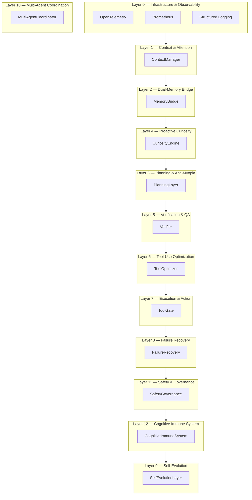

# AIO Framework

A production-grade, modular agent architecture built as a **Cognitive Immune System / Agentic OS**. AIO organizes agent cognition into 13 layers, implemented as a compiled LangGraph `StateGraph` with conditional routing, typed state, and layer-wise observability.

## Architecture

## Quick Links

- [Quick Start](quick-start.md) — install, configure, and run your first query
- [Configuration](configuration.md) — `AIOConfig`, environment variables, and JSON overrides
- [Architecture](architecture/13-layers.md) — deep dive into the 13-layer cognitive stack
- [Streaming](streaming.md) — real-time cognitive event streaming
- [API Reference](api-reference.md) — auto-generated docs for every public module

## Key Components

- **ObservabilityLayer** (Layer 0): OpenTelemetry tracing, Prometheus metrics, structured logging, LangSmith integration.
- **ContextManager** (Layer 1): Token-aware Sculptor, BAPO attention routing, intent classification.
- **MemoryBridge** (Layer 2): Encode-verify-store-consolidate-retrieve-forget lifecycle with hybrid search.
- **PlanningLayer** (Layer 3): Hierarchical planning (HiPlan), lookahead (FLARE), pitfall avoidance (PPA), symbolic MCTS (SPIRAL), DAG decomposition (VMAO).
- **CuriosityEngine** (Layer 4): Novelty detection, information gap identification, intrinsic reward scoring.
- **Verifier** (Layer 5): Multi-modal verification ensemble (LLM critique + FormalJudge + AGEL-Comp).
- **ToolOptimizer** (Layer 6): Tool necessity scoring, policy optimization, prompt optimization (G-STEP / HDPO / JTPRO).
- **ToolGate** (Layer 7): HermesAgent routing, Docker sandbox execution, capability registry, MCP client integration for external tool discovery.
- **FailureRecovery** (Layer 8): ReCiSt state machine, NeuroShield boundaries, anti-fragility learning.
- **SelfEvolutionLayer** (Layer 9): Performance analysis, trend reporting, safe config suggestions, bounded auto-apply.
- **MultiAgentCoordinator** (Layer 10): Task decomposition, simulated dispatch/aggregate/synthesize with consensus scoring.
- **SafetyGovernance** (Layer 11): Per-turn audit trail, constitutional compliance checks, governance voting.
- **CognitiveImmuneSystem** (Layer 12): Anomaly scanning, threat detection, quarantine, auto-heal, immunity status.

## License

MIT
